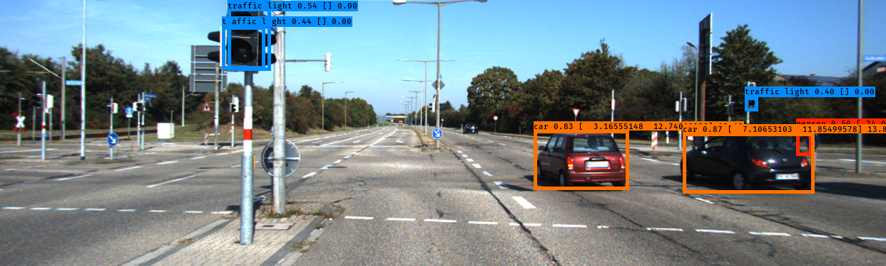

# ObjectTrajectories
Estimate object trajectories in an automotive context, using [KITTI dataset](http://www.cvlibs.net/datasets/kitti/index.php), with CNNs.

A very detailed description of the implamentation is available in the `relazione.pdf` file (but in italian).

The project dependencies are the following Python packets (modules):
- Pillow
- Numpy
- GeoPy
- Keras
- TensorFlow

The CNNs code is based on the following GitHub repos:

- [YOLO: YAD2K - Yet Another Darknet 2 Keras](https://github.com/allanzelener/YAD2K)
- [SSD: Single Shot MultiBox Detector in Keras](https://github.com/oarriaga/single_shot_multibox_detector)
